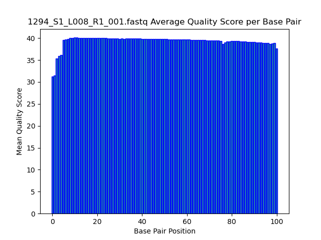
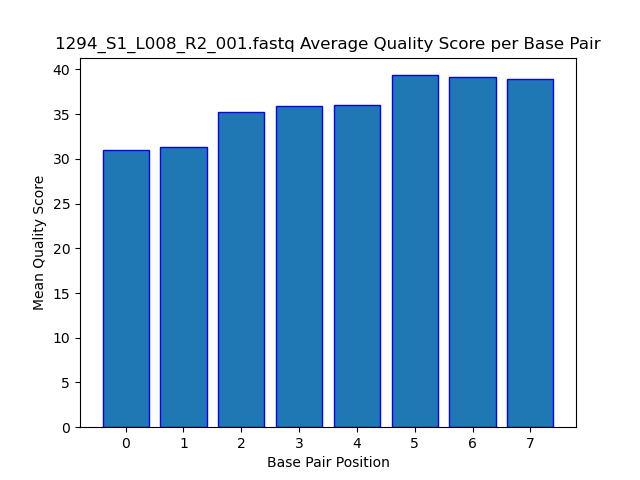
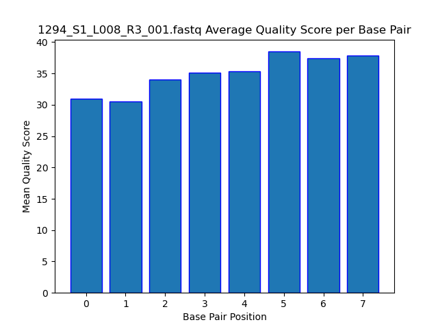
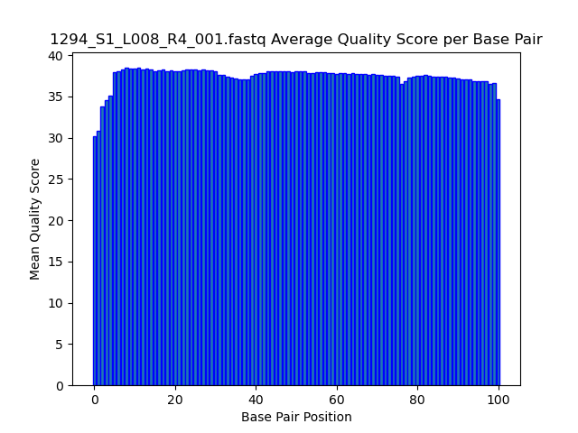

# Assignment the First

## Part 1
1. Be sure to upload your Python script.
`first.py`
`first-idx.py`

| File name | label |
|---|---|
| 1294_S1_L008_R1_001.fastq.gz | Read 1 |
| 1294_S1_L008_R2_001.fastq.gz | Index 1 |
| 1294_S1_L008_R3_001.fastq.gz | Index 2 |
| 1294_S1_L008_R4_001.fastq.gz | Read 2 |

2. Per-base NT distribution
    1. Use markdown to insert your 4 histograms here.
    2. 
    3. 
    4. 
    5. 

    6. Based on the average scores 30 should be a good cutoff. This will give us 99.9% accuracy at each basepair, and we will be able to keep a larger portion of reads (ie. will not need to move reads to unknown/low-read bucket (see below))

    7.

    ```bash
    zcat /projects/bgmp/shared/2017_sequencing/1294_S1_L008_R2_001.fastq.gz | sed -n 2~4p | grep "N" | wc -l
    ```
    `3976613`

    ```bash
    zcat /projects/bgmp/shared/2017_sequencing/1294_S1_L008_R3_001.fastq.gz | sed -n 2~4p | grep "N" | wc -l
    ```
    `3328051`
    
## Part 2
1. Define the problem

We have four fastq files, 2 that contain reads and 2 that contain indexes.

Reads: `1294_S1_L008_R1_001.fastq.gz 294_S1_L008_R4_001.fastq.gz`
Indexes: `1294_S1_L008_R2_001.fastq.gz 1294_S1_L008_R3_001.fastq.gz`

The sequenced library is multiplexed, ie. there are reads from multiple samples, which all have been given a unique index. They need to be demultiplexed, ie. need to be split by index, so that all the sample reads are divided and stored separately. Depending on the conditions during the run, some of the indexes may have been misassigned, or not read correctly. We need to make sure that we have remove those cases and store them separately, and keep indexed read matches stored in their own files. 

2. Describe output

The output will be one R1 FASTQ file and one R4 FASTQ file for each read-index match. Since there are 24 indexes, we can expect 24 R1 Match FASTQ files, and 24 R4 Match FASTQ files, for a total of 48 files. 

Additionally, we will do the same for non-matching indexes (indexes match original 24 but do not match each other). These will be contained in their own R1_Unmatched and R4_Unmatched files.

Finally, reads that have UNKNOWN indexes (not contained within the provided 24 indexes or has 'N') will be in their own R1_Unknown and R4_Unknown FASTQ files.

In total, 52 files will be created. For all categories, the index (i5 and i7) should be added to the header of the read (format: `index1-index2`)

3. Upload your [4 input FASTQ files](../TEST-input_FASTQ) and your [>=6 expected output FASTQ files](../TEST-output_FASTQ).

`See directories`

4. Pseudocode

`A) Store the known indices for easy access.`
`B) For each read index pair, create and open a file with read identifier and index in title (48 files).`
`C) Create buckets for mismatches and non-matches/unknowns, denoted by read number. Open the files and store in data structure for easy access (4 files).`
`D) For each index (R2-R3) record, check against the known indices in memory, and keep a counter for each bucket category (match, unmatch, unknown)`
`    ia) get reverse complement of R3 index (will require flipping string and switching watson-crick basepairing).`
`    ib) calculate and store the quality score of the read`
`    ii) if a match and quality score is good (above threshold)`
`        a) store reads (R1 and R4) into read-index pair bucket (NOTE: there is no specification currently if reverse complement or original sequence should be stored in file)`
`       b) increment match_counter`
`    iii) else if one of the indexes does not match`
`        a) add R1 and R4 record to their respective unmatch bucket`
`        b) increment hop_counter`
`    iv) else if not a match or quality score bad or N found in index`
`        a) add R1 and R4 records to their non-matches/unknowns bucket`
`        b) increment unkown_counter`
`F) Finally print out counters of matching read pairs, unmatched read pairs, and read pairs with index hopping (6 total). `


5. High level functions. For each function, be sure to include:
    1. Description/doc string
    2. Function headers (name and parameters)
    3. Test examples for individual functions
    4. Return statement

    ```Python
    def reverse_complement(sequence:str):
        """
        Purpose: take the sequence and (1) flip it and (2) switch basepairs using watson-crick basepairing
        
        Parameters:
         - Sequence: ssDNA sequence

        Returns: Reverse complement of ssDNA argument as a string

        Example Input: ACTGGC
        Example Output: GCCAGT

        """

        raise NotImplementedError

    def convert_phred(letter):
        """
        Purpose: Converts a single character into a phred score
        Returns: Phred score as integer
        Parameters:
         - Phred33 Encoding

        Example Input: E
        Example Output: 69
        """

        raise NotImplementedError

    def qual_score(phred_score:str):
        """
        Purpose: Calculates the average quality score of the whole phred string
        Returns: Average quality score
        Parameters:
         - phred_score: Phred Score
        
        Example Input: 65 + 67 + 68
        Example Output: 66.67
        """

        raise NotImplementedError

    ```

